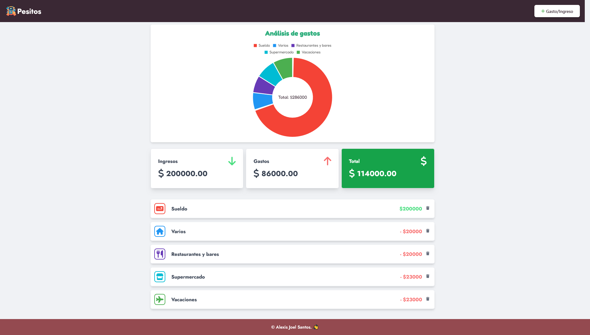

  

# Pesitos - https://pesitos-app.netlify.app/

## Pesitos

- Este proyecto es una plataforma que registra las transacciones monetarias, calcula los saldos, el total tanto de ingresos como de gastos y las lista con el período de tiempo en el cual se desarrollaron las mismas.
- Los datos quedan guardados en el localStorage del navegador.
- El sitio está publicado en **[Netlify](https://www.netlify.com/)**.
- Ingresa al proyecto a través de este link: **<https://pesitos-app.netlify.app///>** 

---
## ❕ Sobre el proyecto 
- El proyecto Pesitos puede ser un proyecto simple, pero cubrió conceptos importantes para el desarrollo de aplicaciones web con React.
- Se hizo uso de React con javascript como tecnologías principales.
- Vite y Tailwind css también fueron implementados en el mismo.
- Pantalla "inicio"

      

---
## ⚙ Visualización de funcionamiento

Para visualizar el funcionamiento, se dejan a continuación una serie de gifs que muestran de manera resumida el funcionamiento del proyecto.

GIF
---
## ❔ ¿De dónde nace la idea del proyecto?
- Este proyecto nace como algo personal para llevar el control de los gastos / ingresos.

### Funcionalidades 
- Registro de un nuevo ingreso / gasto con nombre, monto, tipo, fecha y categoría.
- Cálculo del total de ingresos.
- Cálculo del total de gastos.
- Cálculo del balance (ingresos-gastos).
- Gráfico de torta con el uso de Chartjs.
- Eliminación de transacciónes.

### ¿Qué aprendí? 🧐
- Uso de la librería Chartjs para la representación de gráficos.
- Uso del framework Tailwind para el css. 
- Uso de useReducer y Context API de React para la gestión del estado de la aplicación junto con la división de la lógica en acciones y reductores para la gestión del estado.
- Creación de inputs personalizados para ingresar una fecha.
- Uso de Sonner para mostrar toast personalizados.
- Uso de react-hook-form para el formulario de registro de transacciones.}
- FOTOS DE LAS REGISTRO DE TRANSACCIONES
---
## 👽 Tecnologías utilizadas
- Chartjs
- Date FNS
- DayPicker
  IMÁGEN
- Sonner
- JavaScript
- Netlify
- NodeJS
- React
- React Hook Form
- TailwindCSS
- Vite
- NPM
- Yup
---
## 💻 Requisitos mínimos
- NodeJS
- ReactJS
- Vite
- NPM
---
## 📱 Diseño responsivo
IMÁGENES

